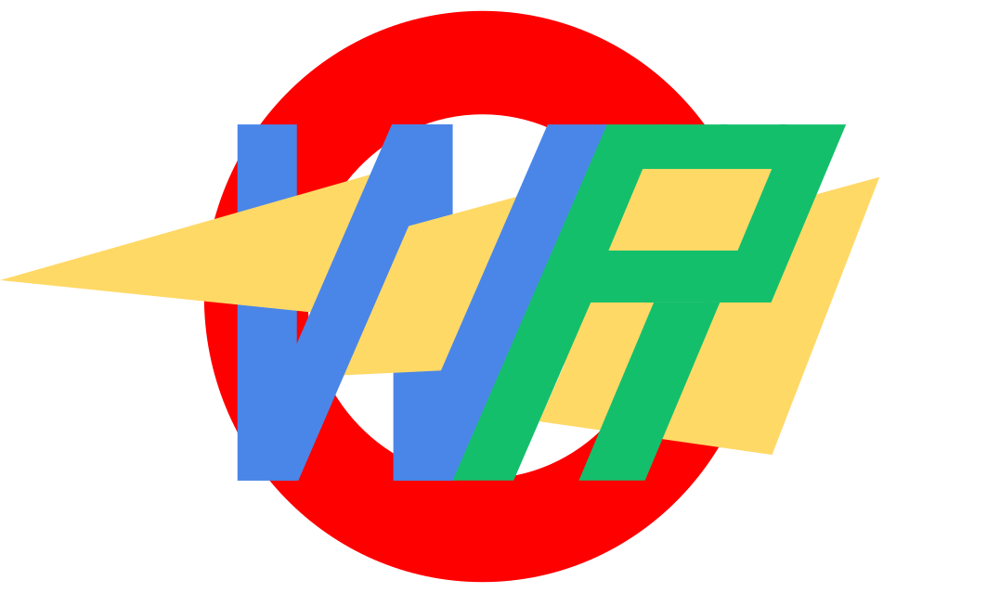

# WebRacer


^ I made a quick mock-up logo, thoughts?

---
## Table of contents
* [General info](#General-info-😎)
* [Technologies](#technologies-💻)
* [Setup](#setup)
* [Plan Moving Forward](#Plan-Moving-Forward-🤔)

## General info 😎
WebRacer is the next leetcode for practicing fast web. You can hop into rooms with friends and compete in a race to see who solves the questions first!
	
## Technologies 💻
The Frontend of this project was created using
* HTML, CSS, JavaScript and JSXML
* the Bootstrap Library
* Love and attention 

The Backend of the Project was made using
* MongoDB
* 
*  
	
## Setup
(✿◡‿◡)
To run this project, install it locally using npm:

```
$ cd ../lorem
$ npm install
$ npm start
```
 

